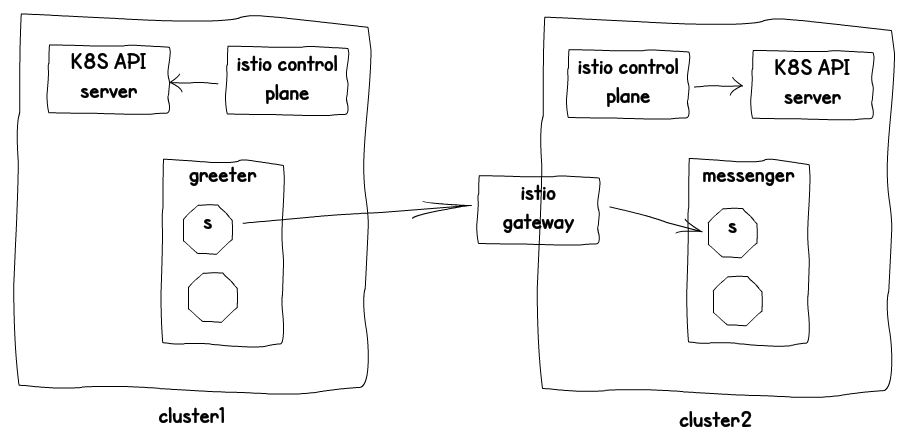
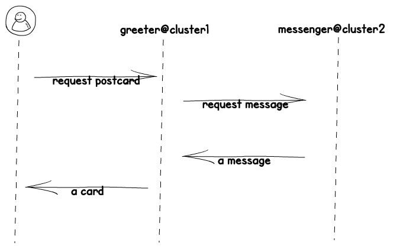

# Cross Cluster Mesh on EKS with Istio

This repo contains a basic setup for running a service mesh with Istio on twe EKS clusters. The setup provided is bas on the [talk](https://mt165.co.uk/speech/cross-cluster-calls-istio-1-1-kubecon-eu-19/])from Matt Truner on the KobeCon 2019 in Barcelona.
he talk / post from Matt Turner i

## Cross cluster with Istio on AWS

The setup below shows how you can setup a multi K8S cluster setup with cross cluster communication via a Service Mesh. For more details on Istio Multi Cluster have a look on the [Istio page](https://istio.io/docs/concepts/multicluster-deployments/)

For the setup we create 2 EKS clusters on Amazon (2). Next deploy Istio (4) using demo certificates (3). Next we delegate traffic (5) for CoreDNS used by EKS. 



Once the basic setup is ready we deploy to cluster 1 the greeter application (6-1) that sends a postcard based on a message received from the messenger (6-2) on cluster 2. For DNS resolution we create a service entry in cluster 1 for the messenger running in cluster 2 (7/8). 
img.



## Setup
The setup written for Mac, in general most scripts should be just basic `bash`. For helm there is a mac dependency in the setup.

Prerequisite
- AWS CLI
- AWS credentials
- kubectl
- tmux

Open a shell and execute the scripts in a follow.


Download dependencies
```
./01a-istio-dl.sh
./01b-helm-dl.sh
```
The next script starts a *tmux* session with a window for each cluster. If you are using environmnet variables for AWS credentials, they are copied. 
```
./01z-shells.sh
```
The next scripts you have to run for both clusters to setup them up.
```
./02-cluster.sh
./03-root-cert.sh
./04-istio-install.sh
./05-delegate-global-stub-coredns.sh
```
For cluster 2 deploy the messenger app.
```
./06-2-deploy-messenger.sh
```
For cluster 1 execute the scripts below
```
./06-1-deploy-greeter.sh
. ./07-1-cluster2-find.sh
./08-1-messenger-service-entry.sh
08x-messenger-service-entry.yaml
```
